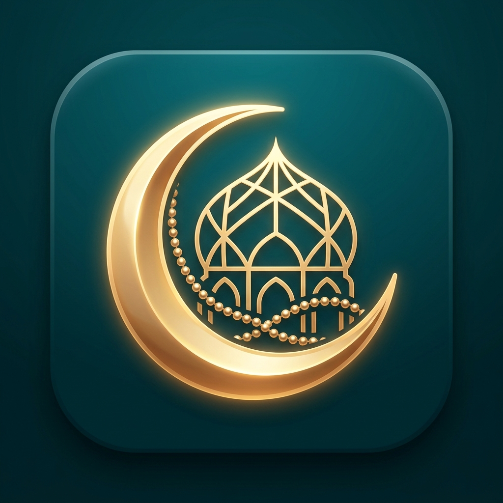

<div align="center">

# 🌙 سَكِينة — Sakeenah
### Modern, Serene Islamic Prayer Times, Daily Adhkar & Qibla Compass App
**تطبيق إسلامي حديث لمواقيت الصلاة، الأذكار اليومية وبوصلة القبلة الفلكية**

[](https://flutter.dev)
[](https://dart.dev)
[](https://developer.android.com)
[](LICENSE)
[](https://behance.net)

</div>

---

## 📖 Overview | نبذة عن التطبيق

**سَكِينة (Sakeenah)** is a beautifully designed, high-performance Islamic application built with Flutter. Inspired by serene minimalism and spiritual mindfulness, it combines astronomical precision calculations with a luxury design system (**Deep Teal & Warm Gold**, with a dedicated **Midnight OLED Dark Mode**).

تم تصميم وبناء التطبيق لتقديم تجربة مستخدم روحانية راقية وخفيفة، مع دقة فلكية تامة في حساب أوقات الصلوات واتجاه القبلة، بالإضافة إلى تجربة تسبيح وتلاوة أذكار يومية متقدمة تعمل بالكامل بدون إنترنت (100% Offline).

---

## ✨ Key Features | أبرز المميزات

### 🕌 1. Smart Prayer Times Engine (محرك مواقيت الصلاة الذكي)
- **Astronomical Precision:** Powered by `adhan_dart` supporting international and regional calculation methods (Egyptian General Authority of Survey, Umm Al-Qura, MWL, ISNA, and custom offsets).
- **Post-Adhan Dynamic Countdown:** 
  - For **30 minutes post-Adhan**: The active prayer is highlighted with an emerald glow and a count-up timer (`+00:15:20 بعد الصلاة`).
  - **After 30 minutes**: Automatically transitions to the upcoming prayer with a precise countdown timer (`00:45:10 متبقية`).
  - **Seamless Night Shift**: Automatically shifts after Isha to target tomorrow's Fajr (`صلاة الفجر`).
- **Hijri Calendar Integration:** Real-time Arabic Hijri date badge (`٨ ربيع الأول ١٤٤٨ هـ`).

### 📍 2. Dual Location Mode (نظام الموقع المزدوج)
- **Automatic GPS Locator:** Instant coordinate resolution with offline caching.
- **Manual City Picker (`LocationPickerSheet`):** Search by Wilaya/City name or choose from instant Algerian and Islamic city presets (وهران، الجزائر، قسنطينة، سطيف، توقرت، مكة المكرمة، المدينة المنورة، etc.).
- **Clean Wilaya Labels:** Automatic normalization removing redundant suffixes for clean display.

### 📿 3. Comprehensive Adhkar & Daily Progress (الأذكار والتسبيح التفاعلي)
- **6 Core Categories:**
  - 🌅 أذكار الصباح (Morning Adhkar)
  - 🌆 أذكار المساء (Evening Adhkar)
  - 🌙 أذكار النوم (Bedtime Adhkar)
  - 🕌 أذكار بعد الصلاة المفروضة (Post-Prayer Adhkar)
  - 🛡️ الرقية الشرعية والأدعية النبوية (Ruqyah & Prophetic Duas)
  - ⭐ أذكاري المخصصة (Custom User Adhkar)
- **Interactive Tap-to-Count:** Tap anywhere on the card to increment with haptic/visual feedback.
- **Individual Repeat Buttons:** Reset and repeat any specific dhikr with the `↻ إعادة الذكر` action.
- **Virtue & Blessing Badges:** Clear contextual explanations of the rewards (فضل الذكر) with ultra-high contrast gold styling.
- **Direct Home Card Link:** Tapping the daily progress card on the home screen immediately opens the active time-relevant adhkar set.

### 🧭 4. Astronomical Qibla Compass (بوصلة القبلة الفلكية)
- **True North & Great Circle Mathematics:** Direct calculation from current coordinates to the Kaaba in Makkah.
- **Distance in Kilometers (KM):** Live computation of exact direct line distance to Makkah.
- **Luxury Concentric Dial:** Golden 3D pointer and Kaaba indicator.

### 🔔 5. Reliable Local Notifications (التنبيهات والإشعارات)
- Built on `flutter_local_notifications` with timezone support (`timezone`).
- High-priority channels with sound and vibration for all 5 daily prayers.
- Exact alarm permissions (`SCHEDULE_EXACT_ALARM`) and reboot recovery receivers.

### 🎨 6. Design System & Aesthetics (الهوية البصرية)
- **Palette:** Deep Teal (`#00342B`), Warm Gold (`#FED488`), and Serene Cream (`#FBF9F1`).
- **Midnight OLED Dark Mode:** True dark slate (`#091210`) with ultra-high contrast typography.
- **Typography:** Tailored Arabic Quranic & geometric typography.
- **100% Offline-Safe:** Zero runtime network font dependencies for instant startup.

---

## 🏗️ Architecture & Tech Stack

```
lib/
├── core/
│   ├── providers/
│   │   ├── adhkar_progress_notifier.dart   # Adhkar counters & daily persistence
│   │   ├── calc_method_notifier.dart       # Calculation method provider
│   │   ├── location_notifier.dart          # GPS & manual city state management
│   │   └── theme_notifier.dart             # Light / Midnight OLED theme state
│   └── theme/
│       └── app_theme.dart                  # Material 3 Design System tokens
├── features/
│   ├── adhkar/
│   │   ├── screens/
│   │   │   ├── adhkar_screen.dart          # Category hub
│   │   │   ├── adhkar_detail_screen.dart   # Interactive counter & card list
│   │   │   └── models/adhkar_model.dart    # JSON serialization models
│   ├── home/
│   │   ├── screens/home_screen.dart        # Hero timer, prayer list & progress
│   │   └── widgets/location_picker_sheet.dart
│   ├── qibla/
│   │   └── screens/qibla_screen.dart       # Astronomical compass & distance
│   ├── settings/
│   │   └── screens/settings_screen.dart    # Preferences & instant test triggers
│   └── root_shell.dart                     # 4-Tab navigation shell
├── services/
│   ├── location_service.dart               # GPS & geocoding helpers
│   └── notification_service.dart           # Local notification scheduling
└── main.dart
```

### Dependencies
| Package | Purpose |
|---|---|
| `adhan_dart` | Astronomical prayer calculation & Qibla math |
| `flutter_local_notifications` | Scheduled & instant native alarms |
| `timezone` | Timezone database for exact scheduling |
| `geolocator` & `geocoding` | GPS coordinates & reverse geocoding |
| `provider` | State management (MultiProvider) |
| `shared_preferences` | Offline persistence |
| `hijri` | Islamic lunar calendar calculations |

---

## 🚀 Getting Started | كيفية التشغيل

### Prerequisites
- Flutter SDK (>= 3.3.0)
- Android SDK (API 34/36) or Xcode for iOS
- Dart SDK (>= 3.3.0)

### Installation & Run

1. **Clone the repository:**
   ```bash
   git clone https://github.com/ghilanimoatazbellah-maker/sakeenah_prayer_app.git
   cd sakeenah_prayer_app
   ```

2. **Install dependencies:**
   ```bash
   flutter pub get
   ```

3. **Run tests:**
   ```bash
   flutter test
   ```

4. **Launch the app (Debug mode):**
   ```bash
   flutter run
   ```

5. **Build production APK (Release mode):**
   ```bash
   flutter build apk --release
   ```

---

## 📱 Screenshots & Showcase

| الرئيسية (Home) | الأذكار (Adhkar) | القراءة والتسبيح (Counter) | القبلة (Qibla) |
| :---: | :---: | :---: | :---: |
|  |  |  |  |

---

## 👨‍💻 Author & Contact

Developed with ❤️ by **Moatazbellah Ghilani**
- **GitHub:** [@ghilanimoatazbellah-maker](https://github.com/ghilanimoatazbellah-maker)
- **Email:** mtzb.gh1@gmail.com

---

## 📜 License

This project is licensed under the MIT License - see the [LICENSE](LICENSE) file for details.
